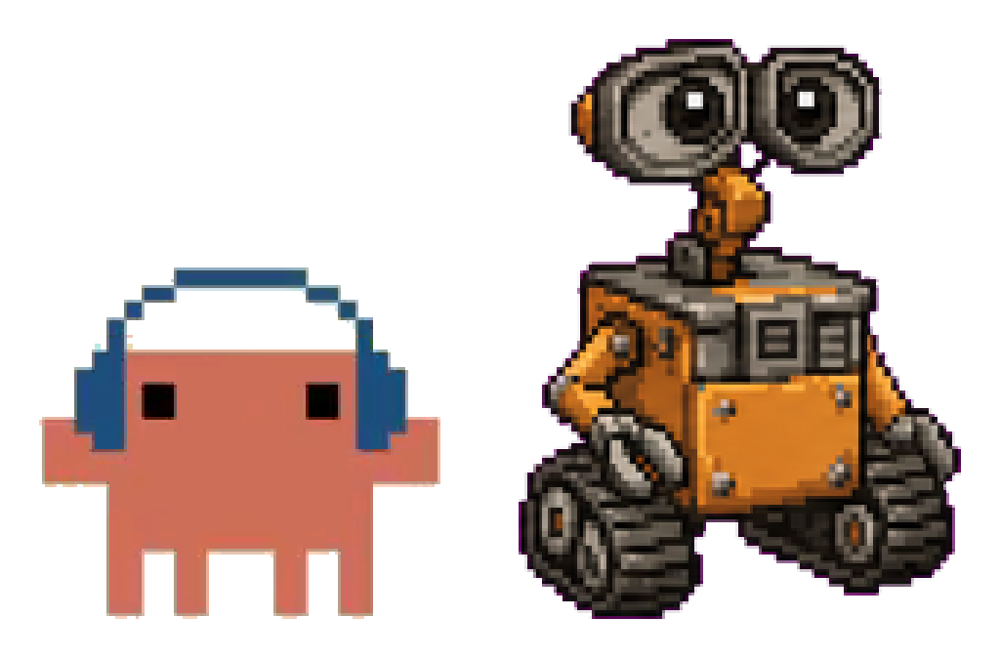

# Tokenmon

**Token + Monster** —— 一只吃你 AI 编程用量长大的桌面像素宠物。

<p align="center">
  
</p>

Tokenmon 趴在你的桌面上，把本机 **Claude Code** 和 **Codex** 的 token 用量实时变成一只活的像素宠物：你烧掉的每个 token 都是它的食物。你写代码它就吃，最近有产出它就开心，闲一阵子会无聊——两天不理它就难过给你看。

> English: [README.md](README.md)

## 功能

- 🍽 **实时喂养** —— 增量读取本机会话日志，新产出 token 数秒内触发进食动画。
- 😄 **心情** —— 在吃 → 开心（近期有产出）→ 无聊（闲了一阵）→ 难过（两天没产出）。阈值可配。
- 💰 **精准成本** —— 按官方单价分模型计费（Claude 按 Opus/Sonnet/Haiku 系列分档；GPT-5.5/5.4 按版本独立定价）。每笔用量按产生它的模型计价，中途切模型也准。缓存读不计入（订阅免费重读）。
- ⏳ **真实额度**（Codex）—— 5 小时 / 周限额百分比直接读自会话日志，hover 可见。
- 🎭 **形象系统** —— 内置 Clawd 和 Chispa；右键「Import from Clipboard」可导入任意 [codex-pets](https://www.npmjs.com/package/codex-pets) 形象；「Action Mapping」按角色重配动画行。
- 🔒 **本地优先** —— 用量数据不离开你的机器。无遥测、无账号、无服务器；唯一的网络请求是你主动触发的形象下载。
- ⚙️ **零配置** —— 自动检测本机装了哪些工具（`~/.claude` / `~/.codex`），每个工具一只宠。

## 安装（macOS，Apple Silicon）

1. 从 [Releases](https://github.com/Bitzip-cop/Tokenmon/releases) 下载最新 `.dmg`。
2. 把 **Tokenmon** 拖进「应用程序」。
3. 首次启动：**右键 → 打开**（ad-hoc 签名、未公证，macOS 会提示一次）。

宠物出现在屏幕右下角。hover 看今日用量，拖动换位置，右键有菜单。

> **注意**：Tokenmon 从首次启动开始计数，不回算历史；显示的金额是 API 等价估算，订阅用户并不真按 token 扣费。

## 源码构建

```bash
pnpm install   # 装依赖 + 按 Electron ABI 重建原生模块
pnpm dev       # 开发模式
pnpm test      # 单元测试
pnpm dist      # 打包 .dmg(apps/desktop/release/)
```

需要 Node ≥ 20、pnpm ≥ 9。技术栈：Electron + React + TypeScript（electron-vite）、better-sqlite3、vitest。

## 配置（环境变量，全部可选）

| 变量 | 含义 | 默认 |
|---|---|---|
| `CLAUDE_CONFIG_DIR` | Claude Code 配置根目录 | `~/.claude` |
| `CODEX_HOME` | Codex 根目录 | `~/.codex` |
| `TOKENMON_PET_SCALE` | 宠物大小（0.3–1.2） | `0.55` |
| `TOKENMON_MOOD_HAPPY_MIN` | 距上次产出多少分钟内算开心 | `30` |
| `TOKENMON_MOOD_SAD_HOURS` | 多少小时没产出转难过 | `48` |

## 成本怎么算

成本 = `输入×in + 产出×out + 缓存写×cw`（每百万 token），逐笔按产生该笔的模型单价累加；缓存**读**单列展示但不计入合计。单价表见英文 README。

## 致谢

- 宠物素材与角色格式来自 [codex-pets](https://www.npmjs.com/package/codex-pets) 项目。
- 用 [Claude Code](https://claude.com/claude-code) 构建。

## 许可

[MIT](LICENSE)
